# Studie App

  

  <strong>Um aplicativo pensado para estudantes, com o objetivo de os ajudar nos seus estudos.</strong>

---

## 🛠️ Tecnologias

  
  
  
  
  
  
  
  

---

## � Screenshots

|  |  |  |
|---|---|---|
|  |

---

## 📚 Documentação

Para documentação completa, acesse: [documentation/README.md](documentation/README.md)

### 📋 Resumo dos Casos de Uso

| ID | Nome | Descrição |
|----|------|-----------|
| UC01 | Gerenciar Disciplinas | CRUD de disciplinas para estudo |
| UC02 | Gerar Plano de Estudos | IA gera plano baseado nas disciplinas |
| UC03 | Gerenciar Cronograma | IA cria cronograma de horários |
| UC04 | Consultar Assistente IA | Chat com assistente para dúvidas |
| UC05 | Utilizar Temporizador | Timer para sessões de estudo |
| UC06 | Visualizar Trilha | Acompanhar progresso dos estudos |

### 📊 Diagrama de Casos de Uso

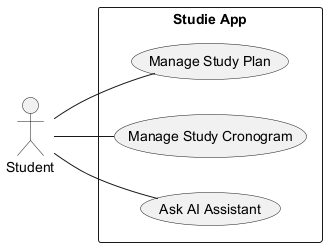

### 📐 Diagramas de Sequência

| Caso de Uso | Diagrama |
|-------------|----------|
| UC01 - Gerenciar Disciplinas | 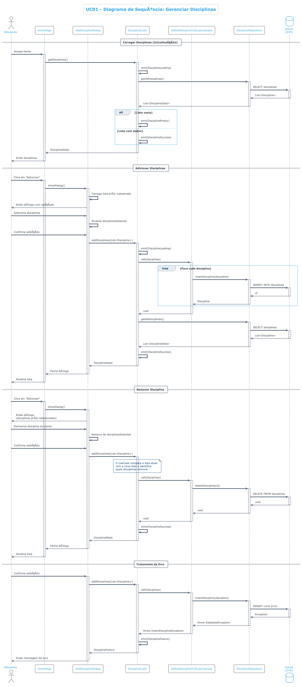 |
| UC02 - Gerar Plano de Estudos | 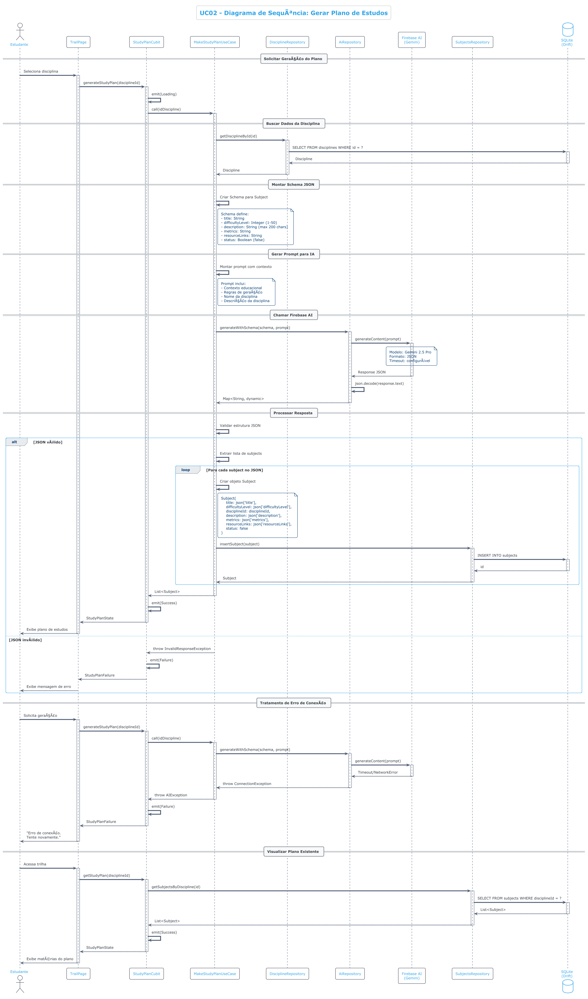 |
| UC03 - Gerenciar Cronograma | 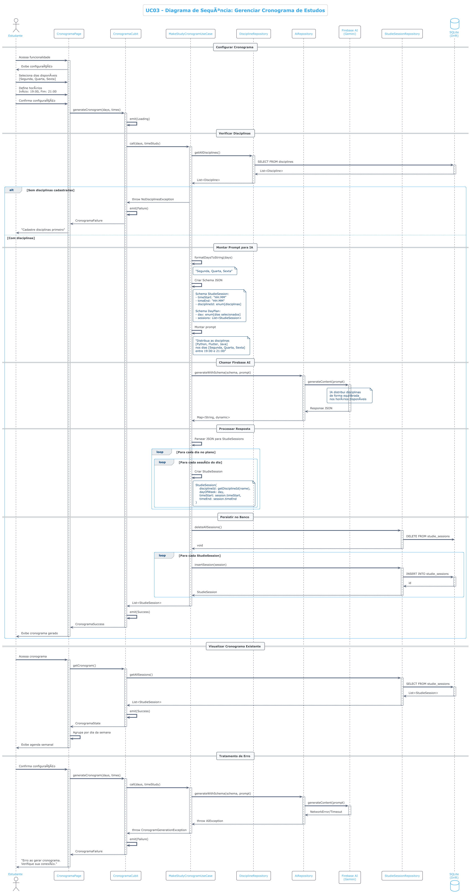 |
| UC04 - Consultar Assistente IA | 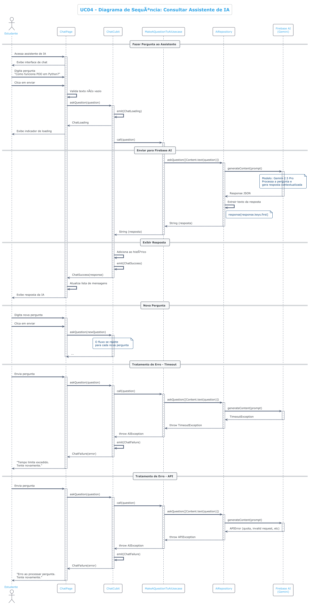 |
| UC05 - Utilizar Temporizador | 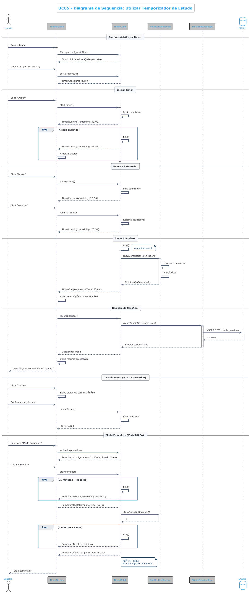 |
| UC06 - Visualizar Trilha | 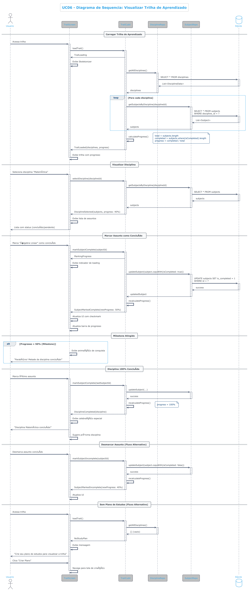 |

### 🔄 Diagramas de Estado

| Caso de Uso | Diagrama |
|-------------|----------|
| UC01 - Gerenciar Disciplinas | 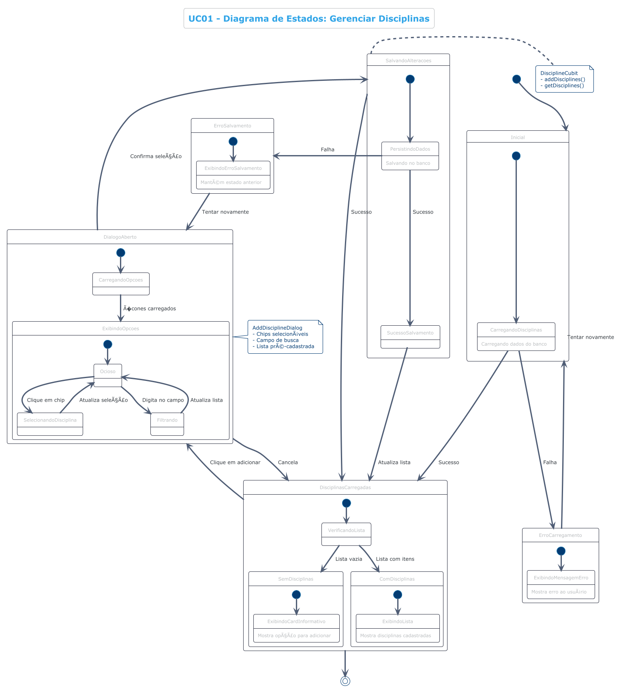 |
| UC02 - Gerar Plano de Estudos | 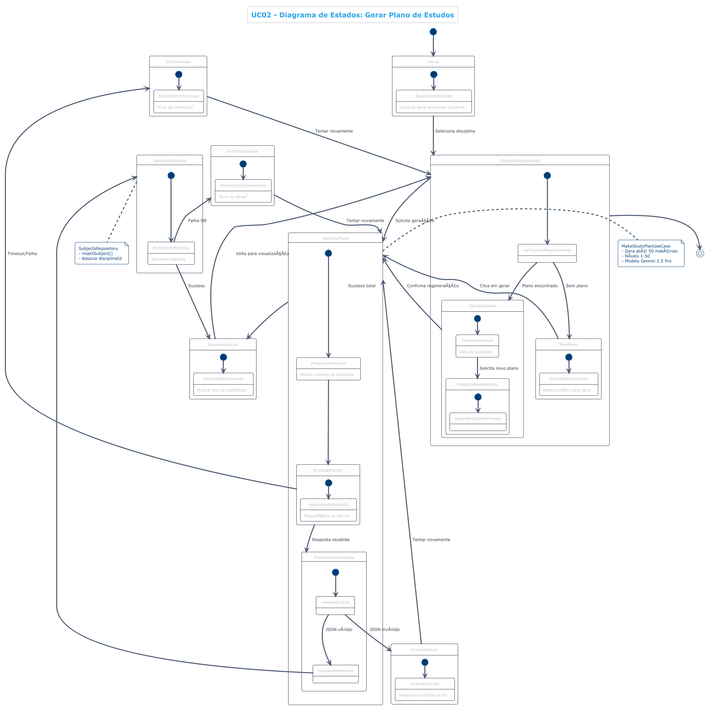 |
| UC03 - Gerenciar Cronograma | 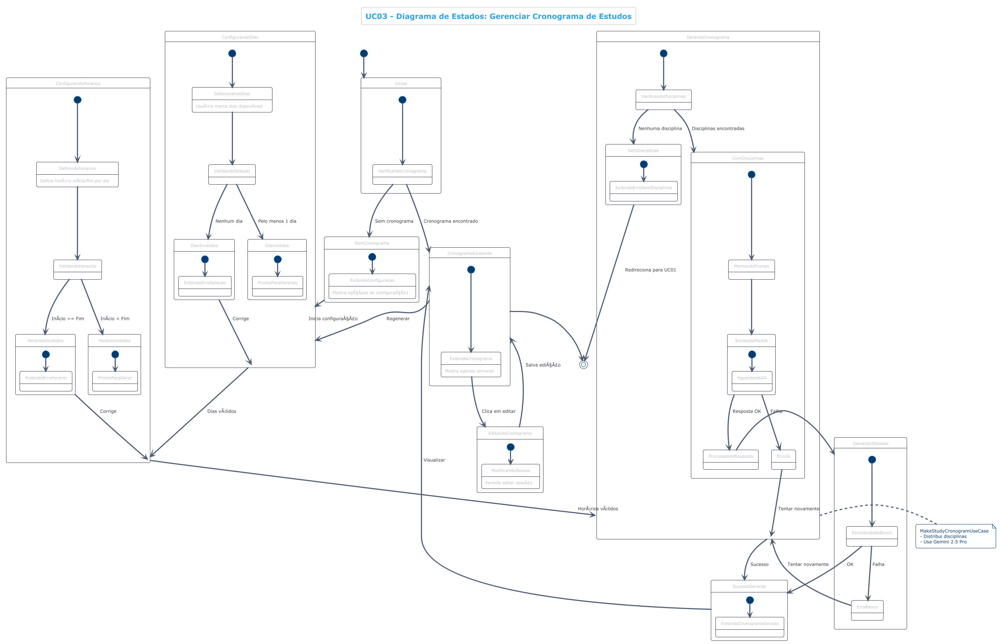 |
| UC04 - Consultar Assistente IA | 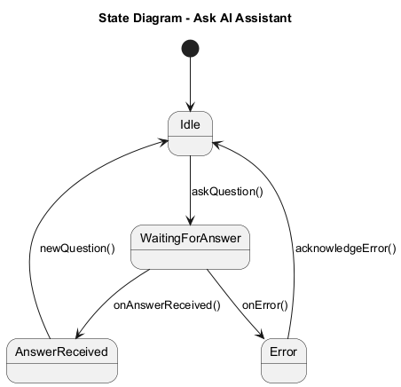 |
| UC05 - Utilizar Temporizador | 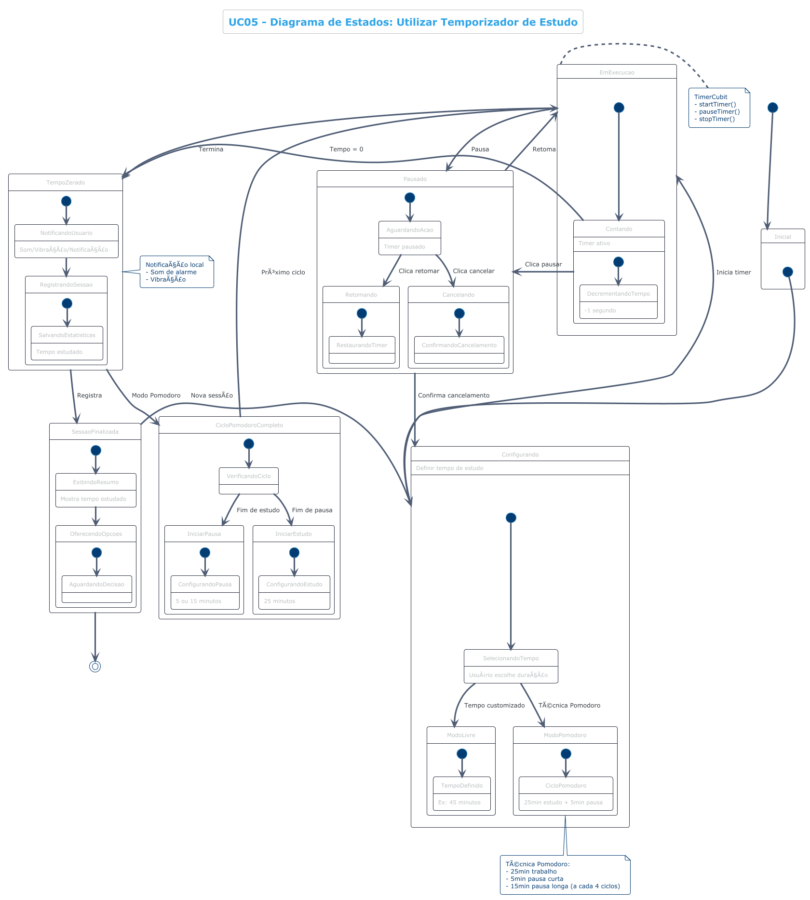 |
| UC06 - Visualizar Trilha |  |

### 🎨 Design System

Para informações sobre o sistema de design e componentes visuais, acesse: [DESIGN_SYSTEM.md](documentation/DESIGN_SYSTEM.md)

---

## 🚀 Começando

Este projeto é um ponto de partida para uma aplicação Flutter.

Alguns recursos para você começar, se este for seu primeiro projeto Flutter:

- [Lab: Write your first Flutter app](https://docs.flutter.dev/get-started/codelab)
- [Cookbook: Useful Flutter samples](https://docs.flutter.dev/cookbook)

Para obter ajuda para começar a usar o desenvolvimento do Flutter, consulte a
[documentação online](https://docs.flutter.dev/), que oferece tutoriais,
exemplos, orientação sobre desenvolvimento móvel e uma referência completa de API.

---

## ✨ Funcionalidades

- **Criação e gerenciamento de tarefas**: permite que os usuários criem e gerenciem suas tarefas.
- **Geração de plano de estudo com tecnologia de IA**: crie planos de estudo personalizados com base em suas necessidades.
- **Chat com IA**: obtenha ajuda e respostas às suas perguntas de um assistente de IA.
- **Temporizador**: um temporizador para o ajudar a concentrar-se nos seus estudos.
- **Integração com Firebase**: utiliza o Firebase para serviços de back-end como IA, App Check e Crashlytics.
- **Tema personalizado**: um tema único e bonito para o aplicativo.
- **Banco de dados local**: usa o Sqflite para armazenar dados localmente.

---

## 🏗️ Arquitetura do Projeto

O projeto segue um padrão de Arquitetura Limpa, separando o código em três camadas principais:

- **Data**: contém a implementação dos repositórios e fontes de dados (locais e remotos).
- **Domain**: contém as regras de negócios, entidades e repositórios abstratos.
- **Presenter**: contém a interface do usuário e a lógica de apresentação (controladores).

O projeto também é dividido em funcionalidades, onde cada funcionalidade possui suas próprias camadas de dados, domínio e apresentador.

---

## ⚙️ Detalhes Técnicos

### 📦 Dependências

- **cupertino_icons**: ícones de estilo iOS.
- **path_provider**: um plug-in do Flutter para encontrar locais comumente usados ​​no sistema de arquivos.
- **path**: uma biblioteca abrangente e multiplataforma de manipulação de caminhos para Dart.
- **firebase_core**: o ponto de entrada para o SDK do Firebase.
- **firebase_crashlytics**: um plug-in do Flutter para o Firebase Crashlytics.
- **firebase_analytics**: um plug-in do Flutter para o Firebase Analytics.
- **firebase_ai**: um plug-in do Flutter para o Firebase AI.
- **firebase_app_check**: um plug-in do Flutter para o Firebase App Check.
- **connectivity_plus**: um plug-in do Flutter para descobrir a conectividade de rede.
- **flutter_ai_toolkit**: um kit de ferramentas para criar aplicativos Flutter com tecnologia de IA.

### 🧪 Dependências de Desenvolvimento

- **flutter_test**: a estrutura de teste para Flutter.
- **flutter_lints**: um conjunto de lints recomendados para incentivar boas práticas de codificação.
- **build_runner**: um sistema de compilação para Dart.
- **mockito**: uma estrutura de simulação para Dart.