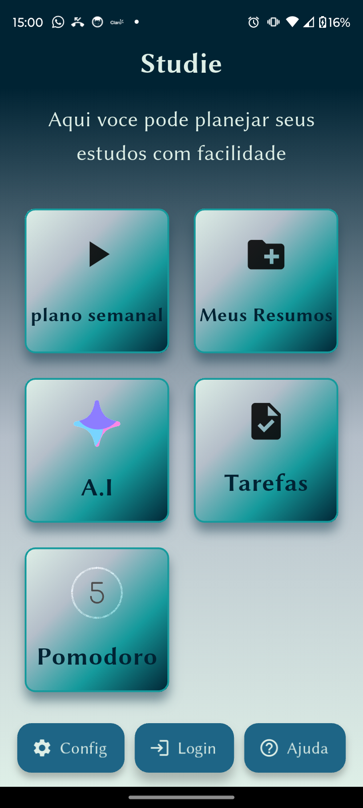
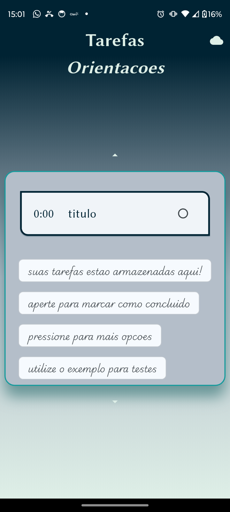
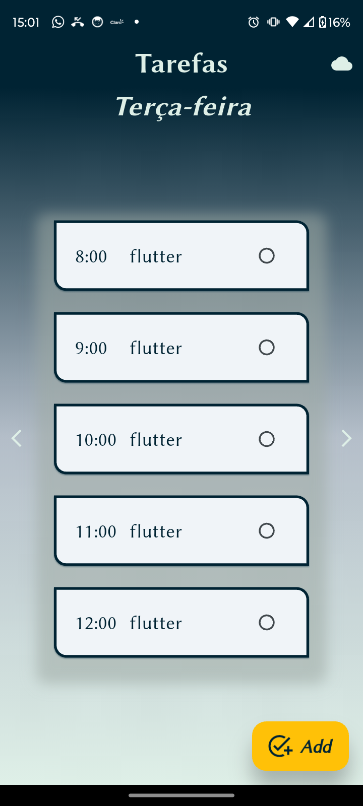

# Studie App

An application designed for students, with the aim of helping them with their studies.

[Versão em Português](README.pt.md)

## Screenshots

|  |  |  |
|---|---|---|
|  |  |  |

## Getting Started

This project is a starting point for a Flutter application.

A few resources to get you started if this is your first Flutter project:

- [Lab: Write your first Flutter app](https://docs.flutter.dev/get-started/codelab)
- [Cookbook: Useful Flutter samples](https://docs.flutter.dev/cookbook)

For help getting started with Flutter development, view the
[online documentation](https://docs.flutter.dev/), which offers tutorials,
samples, guidance on mobile development, and a full API reference.

## Features

- **Task Creation and Management**: Allows users to create and manage their tasks.
- **AI-powered study plan generation**: Create personalized study plans based on your needs.
- **AI Chat**: Get help and answers to your questions from an AI assistant.
- **Timer**: A timer to help you focus on your studies.
- **Firebase Integration**: Utilizes Firebase for backend services like AI, App Check, and Crashlytics.
- **Custom Theme**: A unique and beautiful theme for the app.
- **GetX State Management**: A fast, stable, and easy-to-use state manager.
- **Local Database**: Uses Drift to store data locally.

## Project Architecture

The project follows a Clean Architecture pattern, separating the code into three main layers:

- **Data**: Contains the implementation of the repositories and data sources (local and remote).
- **Domain**: Contains the business rules, entities and abstract repositories.
- **Presenter**: Contains the UI and the presentation logic (controllers).

The project is also divided into features, where each feature has its own data, domain and presenter layers.

## Technical Details

### Dependencies

- **cupertino_icons**: iOS style icons.
- **drift**: A reactive persistence library for Flutter and Dart.
- **drift_flutter**: Flutter-specific utilities for drift.
- **path_provider**: A Flutter plugin for finding commonly used locations on the filesystem.
- **path**: A comprehensive, cross-platform path manipulation library for Dart.
- **get**: A fast, stable, and easy-to-use state manager.
- **carousel_slider**: A carousel slider widget.
- **firebase_core**: The entry point for the Firebase SDK.
- **lottie**: A library for parsing Adobe After Effects animations exported as json.
- **firebase_crashlytics**: A Flutter plugin for Firebase Crashlytics.
- **firebase_analytics**: A Flutter plugin for Firebase Analytics.
- **firebase_ai**: A Flutter plugin for Firebase AI.
- **firebase_app_check**: A Flutter plugin for Firebase App Check.
- **connectivity_plus**: A Flutter plugin to discover network connectivity.
- **flutter_ai_toolkit**: A toolkit for building AI-powered Flutter apps.

### Dev Dependencies

- **flutter_test**: The testing framework for Flutter.
- **flutter_lints**: A set of recommended lints to encourage good coding practices.
- **build_runner**: A build system for Dart.
- **drift_dev**: The code generator for drift.
- **mockito**: A mocking framework for Dart.
- **flutter_launcher_icons**: A command-line tool which simplifies the task of updating your Flutter app's launcher icon.

## How to Run

1. Clone the repository.
2. Run `flutter pub get`.
3. Run `flutter run`.
