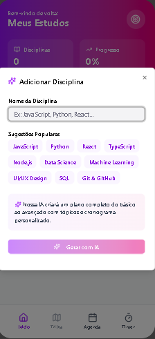
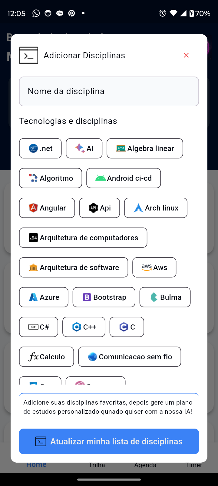
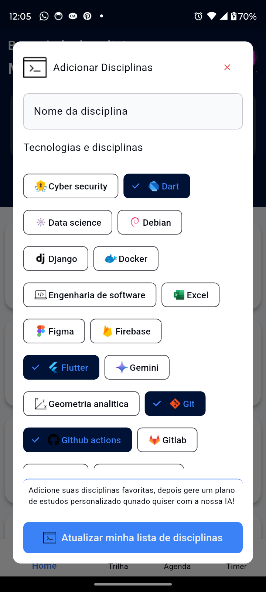
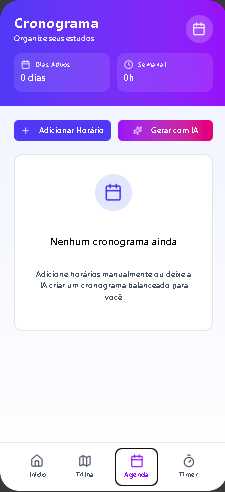
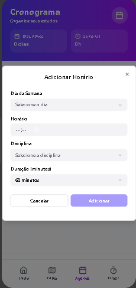

# Studie App

Um aplicativo pensado para estudantes, com o objetivo de os ajudar nos seus estudos.

[English Version](README.md)

## Screenshots

|  |  |  |
|---|---|---|
|  |  |  |

## Começando

Este projeto é um ponto de partida para uma aplicação Flutter.

Alguns recursos para você começar, se este for seu primeiro projeto Flutter:

- [Lab: Write your first Flutter app](https://docs.flutter.dev/get-started/codelab)
- [Cookbook: Useful Flutter samples](https://docs.flutter.dev/cookbook)

Para obter ajuda para começar a usar o desenvolvimento do Flutter, consulte a
[documentação online](https://docs.flutter.dev/), que oferece tutoriais,
exemplos, orientação sobre desenvolvimento móvel e uma referência completa de API.

## Funcionalidades

- **Criação e gerenciamento de tarefas**: permite que os usuários criem e gerenciem suas tarefas.
- **Geração de plano de estudo com tecnologia de IA**: crie planos de estudo personalizados com base em suas necessidades.
- **Chat com IA**: obtenha ajuda e respostas às suas perguntas de um assistente de IA.
- **Temporizador**: um temporizador para o ajudar a concentrar-se nos seus estudos.
- **Integração com Firebase**: utiliza o Firebase para serviços de back-end como IA, App Check e Crashlytics.
- **Tema personalizado**: um tema único e bonito para o aplicativo.
- **Gerenciamento de estado GetX**: um gerenciador de estado rápido, estável e fácil de usar.
- **Banco de dados local**: usa o Drift para armazenar dados localmente.

## Arquitetura do Projeto

O projeto segue um padrão de Arquitetura Limpa, separando o código em três camadas principais:

- **Data**: contém a implementação dos repositórios e fontes de dados (locais e remotos).
- **Domain**: contém as regras de negócios, entidades e repositórios abstratos.
- **Presenter**: contém a interface do usuário e a lógica de apresentação (controladores).

O projeto também é dividido em funcionalidades, onde cada funcionalidade possui suas próprias camadas de dados, domínio e apresentador.

## Detalhes técnicos

### Dependências

- **cupertino_icons**: ícones de estilo iOS.
- **drift**: uma biblioteca de persistência reativa para Flutter e Dart.
- **drift_flutter**: utilitários específicos do Flutter para drift.
- **path_provider**: um plug-in do Flutter para encontrar locais comumente usados ​​no sistema de arquivos.
- **path**: uma biblioteca abrangente e multiplataforma de manipulação de caminhos para Dart.
- **get**: um gerenciador de estado rápido, estável e fácil de usar.
- **carousel_slider**: um widget de controle deslizante de carrossel.
- **firebase_core**: o ponto de entrada para o SDK do Firebase.
- **lottie**: uma biblioteca para analisar animações do Adobe After Effects exportadas como json.
- **firebase_crashlytics**: um plug-in do Flutter para o Firebase Crashlytics.
- **firebase_analytics**: um plug-in do Flutter para o Firebase Analytics.
- **firebase_ai**: um plug-in do Flutter para o Firebase AI.
- **firebase_app_check**: um plug-in do Flutter para o Firebase App Check.
- **connectivity_plus**: um plug-in do Flutter para descobrir a conectividade de rede.
- **flutter_ai_toolkit**: um kit de ferramentas para criar aplicativos Flutter com tecnologia de IA.

### Dependências de desenvolvimento

- **flutter_test**: a estrutura de teste para Flutter.
- **flutter_lints**: um conjunto de lints recomendados para incentivar boas práticas de codificação.
- **build_runner**: um sistema de compilação para Dart.
- **drift_dev**: o gerador de código para drift.
- **mockito**: uma estrutura de simulação para Dart.
- **flutter_launcher_icons**: uma ferramenta de linha de comando que simplifica a tarefa de atualizar o ícone do iniciador do seu aplicativo Flutter.

## Como executar

1. Clone o repositório.
2. Execute `flutter pub get`.
3. Execute `flutter run`.